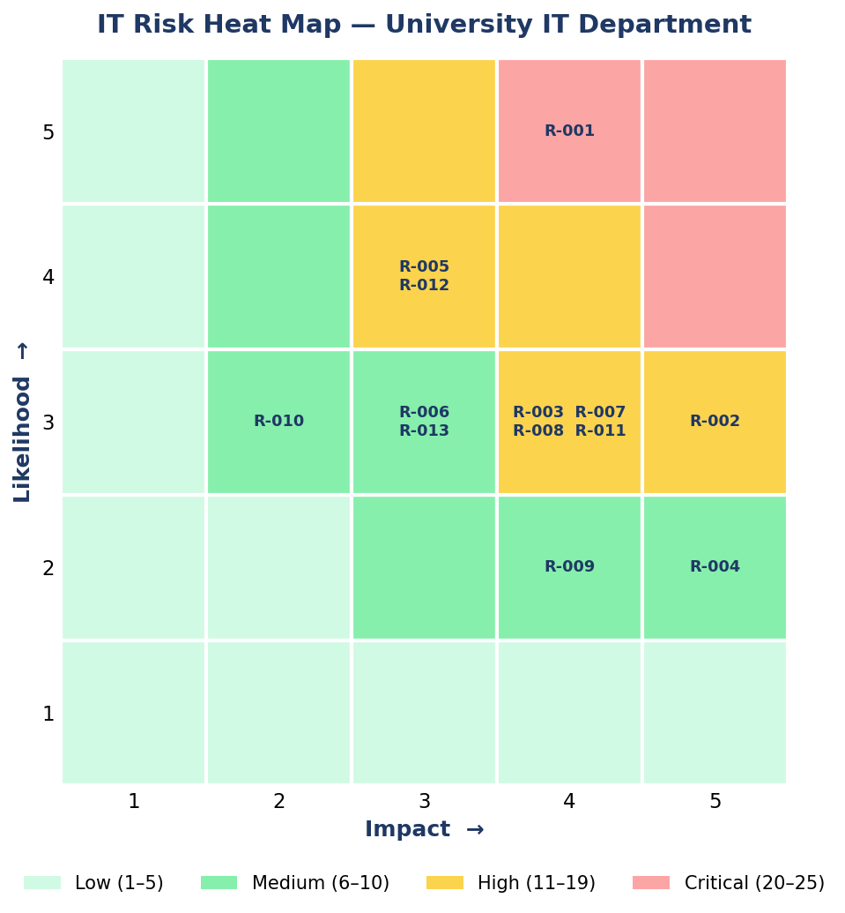

# IT-Risk-Register-University
A complete GRC IT Risk Register for a fictional University IT Department — 13 risks, heat map, and executive summary. Aligned to ISO 27001 and NIST CSF.
**Author:** Rushikesh Pandya  
**Programme:** MSc Enterprise & IT Security  
**Date:** June 2026  
**Framework Alignment:** ISO 27001 | NIST CSF | GDPR  

---
## 📋 Project Overview

A complete GRC (Governance, Risk & Compliance) project built from scratch as part of my MSc in Enterprise & IT Security. This project simulates a real-world IT risk assessment for a fictional University IT Department.

---
## 📁 Files in This Repository

| File | Description |
|------|-------------|
| `University_IT_Risk_Register.xlsx` | Full risk register with 13 risks, scoring formulas, and color-coded heat map |
| `GRC_Executive_Summary.pdf` | Management-level executive summary report |
| `heat_map_preview.png` | Visual preview of the 5×5 risk heat map |

---
## 🎯 What This Project Covers

- **13 risks identified** across 4 domains: Cybersecurity, Operational, Compliance, Third-party & Physical
- **Qualitative scoring model** — Likelihood × Impact (1–5 scale), max score 25
- **1 Critical risk** — Phishing (score: 20/25)
- **8 High risks** — including ransomware, unauthorized access, system downtime, GDPR non-compliance
- **4 Medium risks** — including software licensing, Wi-Fi exploitation, audit failures

---
## 🗺️ Risk Heat Map Preview

---

## 🛠️ Tools & Frameworks Used

- Microsoft Excel (risk register + heat map)
- Microsoft Word (executive summary)
- ISO 27001 (risk management principles)
- NIST Cybersecurity Framework (CSF)
- GDPR compliance concepts

---

## 📬 Connect with Me

[LinkedIn](https://www.linkedin.com/in/rushikesh-pandya-70131a299)
